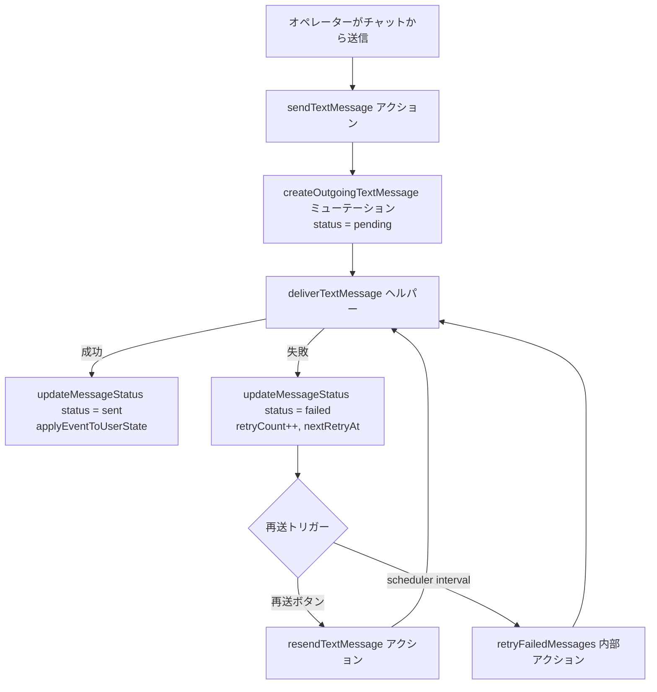

# Vite Convex LINE Chat

[English](README.md) | 日本語

## 概要

React 19 と Convex を組み合わせて、LINE 風のサポート向けチャットコンソールを構築するプロジェクトです。会話タイムラインとコンタクト管理を一体化し、LINE メッセージの応答を 1 つのワークスペースで完結させます。

## 主な特徴

- 会話リスト、メッセージバブル、レスポンシブなサイドバーを備えたインタラクティブなチャットレイアウト。
- Convex を用いたリアルタイムデータベースで、LINE Messaging API からのコンタクト・スレッド・Webhook イベントを保存。
- LINE Bot SDK によるリクエスト検証と返信送信の統合。
- `src/lib/` 配下に共通のテーマトークンやヘルパーをまとめたユーティリティ群。

## 技術スタック

- React 19 + TypeScript + Vite 7（Rolldown ビルド）
- Convex によるクエリ・ミューテーションとデータストア
- Tailwind CSS と `src/lib/theme/tokens.ts` のデザイントークン
- Biome（Lint/Format）、Knip（未使用コード検出）、Vitest（今後のテスト）

## ディレクトリ構成

- `src/`: React アプリのエントリ（`main.tsx`, `App.tsx`）やチャット UI コンポーネント、フック、アセット
- `public/`: Vite がそのまま配信する静的ファイル
- `convex/`: Convex のスキーマ、クエリ、ミューテーション（`convex/_generated/` は自動生成のため編集禁止）
- `shared/`: LINE ユーザー型などの実行環境共通タイプ
- `env.ts`: 必須の LINE 認証情報を起動時に検証する Zod スキーマ
- ルート直下: `biome.jsonc`, `knip.json`, `tsconfig.*`, `lefthook.yml` などのツール設定

## セットアップ手順

1. 依存関係をインストール: `npm install`
2. シェルから参照できるように次の環境変数を定義（例: `.env.local` やシェル設定に追記）
   - `LINE_CHANNEL_SECRET`
   - `LINE_CHANNEL_ACCESS_TOKEN`
3. 開発サーバーを起動: `npm run dev`
   - `convex dev` と `vite --open` が並列で立ち上がり、ブラウザタブが自動で開きます。
4. ブラウザでチャット UI を確認し、Convex のローカルエンドポイント（既定で `http://localhost:7878`）に接続。

## 開発ワークフロー

- `npm run lint`: Biome でスタイルチェック
- `npm run format`: Biome で自動整形
- `npm run build`: 型チェックと本番ビルド
- `npm run preview`: 生成済みビルドのプレビュー
- `npm run knip`: 未使用モジュール・エクスポートの検出

Pull Request を作成する前に `npm run build` と `npm run lint` を実行し、`npx convex dev` を用いたローカル環境で LINE チャットの動作確認を行い、結果を PR 説明に記録してください。

近々のタスクやバックログは `todo.md` を参照してください。

## 再送信フロー

送信メッセージは Convex に配信メタデータ付きで保存され、自動・手動の再送どちらでも同じ処理を通ります。以下の図に流れをまとめています。

### 実装メモ

- `deliverTextMessage` が LINE Push API 呼び出しとステータス更新を一手に担い、成功・失敗どちらの場合も Convex の状態を即座に同期します。
- 失敗したメッセージは `retryCount`, `nextRetryAt`, `lastAttemptAt` を記録し、`retryFailedMessages` が 1 分ごとに再送可能なものだけを処理します。
- チャットバブルの「再送」ボタンも同じヘルパーを使うため、UI での手動再送とバックグラウンド再送の挙動が一致します。
