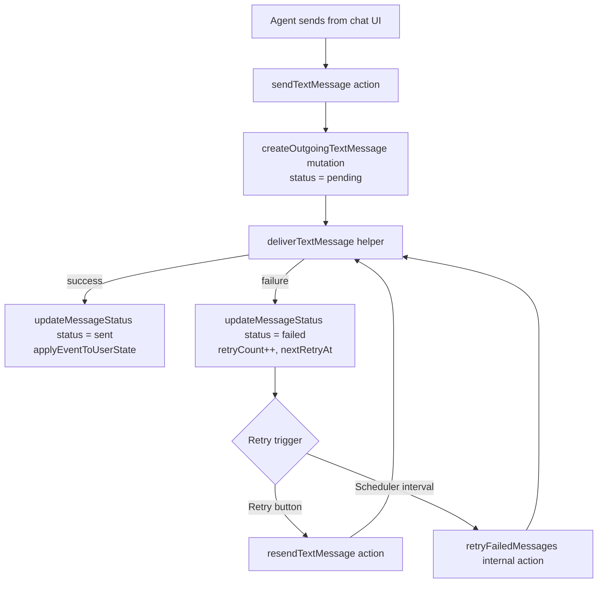

# Vite Convex LINE Chat

English | [日本語](README-ja.md)

## Overview

This project provides a LINE-inspired chat console built with React 19 and Convex. It combines a real-time conversation timeline with contact management so support teams can triage LINE messages from a single workspace.

## Key Features

- Interactive chat layout with conversation list, message bubble components, and a responsive sidebar.
- Convex backend for storing contacts, threads, and webhook events from the LINE Messaging API.
- LINE Bot SDK integration for validating requests and sending replies.
- Utility library in `src/lib/` with shared theming tokens and helpers.

## Tech Stack

- React 19 + TypeScript on top of Vite 7 (Rolldown build).
- Convex functions and database for real-time data access.
- Tailwind CSS for styling with design tokens in `src/lib/theme/tokens.ts`.
- Biome for linting/formatting, Knip for unused code detection, Vitest for future tests.

## Project Structure

- `src/`: React application entry (`main.tsx`, `App.tsx`), chat UI components, hooks, and assets.
- `public/`: Static files served as-is by Vite.
- `convex/`: Convex schema, queries, and mutations (do not edit `convex/_generated/`).
- `shared/`: Cross-runtime types such as LINE user definitions.
- `env.ts`: Zod schema that enforces required LINE credentials at startup.
- Tooling configs (`biome.jsonc`, `knip.json`, `tsconfig.*`, `lefthook.yml`) live at the repository root.

## Getting Started

1. Install dependencies: `npm install`.
2. Export the required environment variables or place them in a `.env.local` file consumed by your shell:
   - `LINE_CHANNEL_SECRET`
   - `LINE_CHANNEL_ACCESS_TOKEN`
3. Start the development servers in one command: `npm run dev`. This runs `convex dev` and `vite --open` in parallel.
4. Open the browser tab launched by Vite to inspect the chat interface. Convex will expose functions at `http://localhost:7878` by default.

## Development Workflow

- `npm run lint`: Check code style with Biome.
- `npm run format`: Apply Biome fixes.
- `npm run build`: Type-check and create a production bundle.
- `npm run preview`: Serve the last production build locally.
- `npm run knip`: Detect unused modules or exports.

Before opening a pull request, run `npm run build` and `npm run lint`, test LINE chat flows against a local Convex deployment (`npx convex dev`), and capture screenshots or terminal output in the PR description.

Refer to `todo.md` for near-term implementation tasks and backlog items.

## Message Retry Flow

Outgoing messages persist to Convex with delivery metadata so both automatic and manual retries share the same path. The diagram below summarizes the flow:



### Implementation Notes

- `deliverTextMessage` centralizes the LINE Push API call and status updates so Convex stays consistent regardless of success or failure.
- Failed deliveries track `retryCount`, `nextRetryAt`, and `lastAttemptAt`, which the `retryFailedMessages` worker uses every minute to decide which records to retry.
- The chat UI exposes a “Retry” button on failed bubbles; manual retries run the same helper, keeping behavior aligned with the scheduled job.

## Rich Media Capture & Rendering

Incoming LINE messages now flow through a dedicated media pipeline so files, stickers, and location payloads appear alongside text:

1. `convex/line/webhook.ts` normalises every webhook event, mapping LINE message types into a `content` union. Media events invoke a helper action to download the binary payload.
2. `convex/line/content.ts` uses the `MessagingApiBlobClient` to stream the attachment, stores it in Convex Storage, and returns metadata (size, MIME type, storage ID).
3. `convex/line/messages.listTimelineByLineUser` emits timeline entries that contain both the original message document and a resolved, signed download URL (when storage IDs exist).
4. React components consume that enriched timeline; `ChatMessageBubble` renders inline image/video/audio previews and falls back to download links for other file types.

When upgrading an existing deployment that only stored text, run the maintenance mutation once to backfill historical rows before re-deploying strict schema validators:

```bash
npx convex run internal.maintenance.migrations.migrateRichMessaging
```

Signed URLs generated by Convex expire automatically; the query refetches data when the chat view re-mounts so operators always receive fresh links.

### Manual Verification Checklist

Use the LINE Messaging API Test Console or a sandbox account to verify end-to-end behaviour:

1. Start the dev environment with `npm run dev` and ensure `convex dev` and Vite both report healthy.
2. Send a text message from LINE; confirm the chat timeline shows the bubble and the contact sidebar summary updates.
3. Send an image and a PDF (file message). The timeline should show an inline image preview and a download link for the document.
4. Send an audio clip or video; the bubble should expose a native `<audio>`/`<video>` player with controls.
5. Inspect Convex Storage in the dashboard (or via `npx convex dashboard`) to confirm the binary assets were persisted and linked to the saved message documents.
6. Trigger an operator reply from the UI and observe that the retry button appears only when the push delivery fails.
